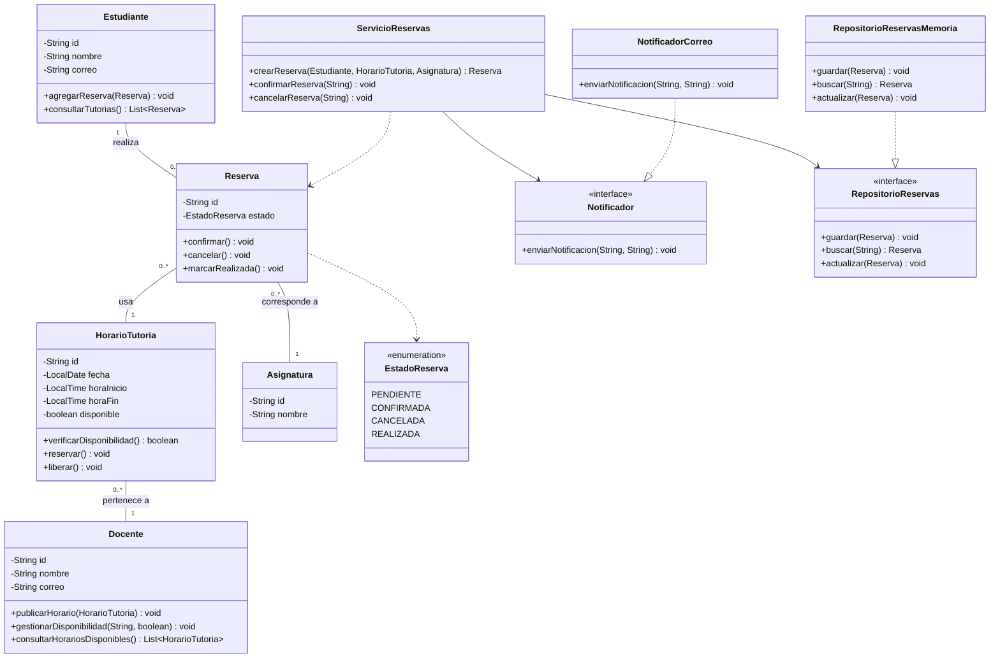

# Sistema de Gestión de Tutorías

Proyecto de la Actividad 5 (Ae1) de Diseño de Software (UCOM0310), Universidad Espíritu Santo. Implementa el modelo orientado a objetos de un sistema de gestión de tutorías académicas en Java con Maven.

## Descripción del problema

Los estudiantes necesitan reservar tutorías con los docentes de sus asignaturas. Los docentes publican horarios disponibles, el estudiante solicita una reserva sobre uno de esos horarios y la reserva pasa por distintos estados (pendiente, confirmada, cancelada o realizada). El sistema debe validar la disponibilidad, notificar los eventos importantes al estudiante y guardar la información sin que la lógica del dominio dependa de una tecnología concreta.

## Clases principales y responsabilidades

| Clase / Interfaz | Responsabilidad |
|---|---|
| `Estudiante` | Representa al estudiante y mantiene sus reservas realizadas. |
| `Docente` | Publica horarios de tutoría y gestiona su disponibilidad. |
| `HorarioTutoria` | Representa un bloque de tutoría de un docente y controla si está disponible u ocupado. |
| `Asignatura` | Identifica la materia sobre la que se da la tutoría. |
| `Reserva` | Registra el encuentro y protege las reglas de transición entre estados. |
| `EstadoReserva` | Enumera los estados válidos de una reserva. |
| `ServicioReservas` | Coordina la creación, confirmación y cancelación de reservas usando el repositorio y el notificador. |
| `RepositorioReservas` (interfaz) | Define cómo se guarda y se busca una reserva sin fijar la tecnología. |
| `RepositorioReservasMemoria` | Implementación en memoria del repositorio para esta etapa del proyecto. |
| `Notificador` (interfaz) | Define el contrato para comunicar eventos al usuario. |
| `NotificadorCorreo` | Implementación que simula el envío de correos por consola. |

## Decisiones de diseño

- Se usó composición en lugar de herencia: una `Reserva` se compone de un `Estudiante`, un `HorarioTutoria` y una `Asignatura`, porque la relación real es "tiene un", no "es un".
- Las reglas de estado viven dentro de `Reserva` (`confirmar`, `cancelar`, `marcarRealizada`): el atributo `estado` no tiene setter público, así ningún otro componente puede saltarse las validaciones.
- `HorarioTutoria` encapsula su disponibilidad con `reservar()` y `liberar()`, de modo que no se puede ocupar dos veces el mismo horario.
- `ServicioReservas` concentra la coordinación del caso de uso (validar disponibilidad, crear la reserva, guardar y notificar) para que las clases del dominio no dependan de infraestructura.

## Principios SOLID aplicados

- **SRP (Responsabilidad Única):** `ServicioReservas` solo coordina el caso de uso; las reglas de estado están en `Reserva`, la persistencia en el repositorio y la comunicación en el notificador. Un cambio en la forma de notificar no obliga a tocar el dominio.
- **DIP (Inversión de Dependencias):** `ServicioReservas` depende de las interfaces `RepositorioReservas` y `Notificador`, que recibe por constructor, y no de implementaciones concretas. Cambiar la persistencia en memoria por una base de datos, o el correo por otro canal, solo requiere una nueva implementación de la interfaz.
- **OCP (Abierto/Cerrado):** como consecuencia de lo anterior, se pueden agregar nuevos tipos de notificación o de persistencia sin modificar el código existente del servicio.

## Diagrama UML

El diagrama fuente está en [docs/modelo-clases.puml](docs/modelo-clases.puml) y la imagen exportada en [docs/modelo-clases.png](docs/modelo-clases.png).



## Estructura del proyecto

```
sistema-tutorias/
├── README.md
├── pom.xml
├── docs/
│   ├── modelo-clases.puml
│   └── modelo-clases.png
└── src/
    ├── main/java/edu/uees/tutorias/
    │   ├── App.java
    │   ├── domain/
    │   ├── service/
    │   ├── repository/
    │   └── notification/
    └── test/java/edu/uees/tutorias/
```

## Requisitos

- Java 21 o superior
- Maven 3.9 o superior

## Compilación y ejecución

```
mvn clean compile
mvn clean test
```

Para ver el flujo completo de una reserva (crear, confirmar y cancelar):

```
mvn compile
java -cp target/classes edu.uees.tutorias.App
```

## Declaración de uso de IA

Durante el desarrollo de esta actividad utilicé herramientas de inteligencia artificial como apoyo para organizar la estructura del proyecto y revisar las decisiones de diseño. Verifiqué y adapté los resultados obtenidos, y puedo explicar y justificar el código y las decisiones presentadas.
