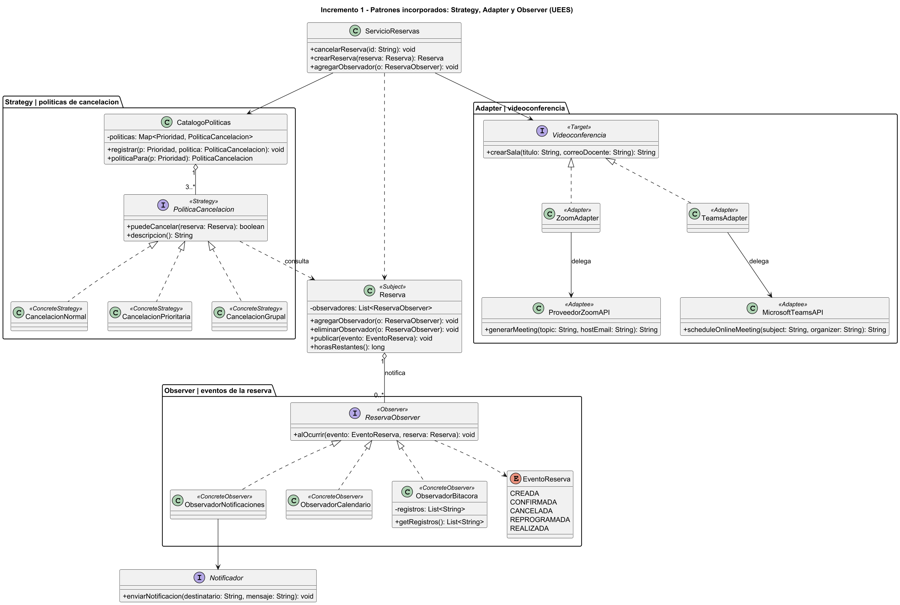

# Sistema de Gestión de Tutorías — Incremento 1 (Ae3)

Proyecto integrador de Diseño de Software (UCOM0310), Universidad de Especialidades Espíritu Santo.
Sistema de gestión de tutorías académicas en Java 21 con Maven.

- **Autora:** Andrea Illescas
- **Docente:** Ph.D. Jaime Paul Sayago
- **Repositorio:** https://github.com/Anghy2003/sistema-tutorias

Este repositorio contiene la evolución completa del proyecto: el diseño orientado a objetos de Ae1
y, sobre esa misma base, el **incremento 1** de Ae3, que incorpora los patrones justificados por
problemas reales detectados en el código existente.

## 1. Propósito del proyecto

Los estudiantes reservan tutorías con los docentes de sus asignaturas. El docente publica horarios
disponibles, el estudiante solicita una reserva sobre uno de ellos y la reserva recorre distintos
estados (pendiente, confirmada, cancelada o realizada). El sistema valida la disponibilidad,
comunica lo que ocurre y guarda la información sin que el dominio dependa de una tecnología
concreta.

## 2. Problema y alcance del incremento

La línea base (Ae1) compilaba y pasaba sus 12 pruebas, pero al revisar el UML y el código
aparecieron tres puntos de dolor concretos:

| Situación observada en el código | Problema de diseño | Patrón aplicado |
|---|---|---|
| `ServicioReservas` armaba y enviaba el mensaje de notificación en `crearReserva`, `confirmarReserva` y `cancelarReserva`. | Un solo receptor cableado dentro del servicio; agregar calendario o auditoría obligaba a modificar los tres métodos. | **Observer** |
| `cancelarReserva` cancelaba siempre que el estado lo permitiera, sin considerar la anticipación, y la universidad aplica plazos distintos según el tipo de tutoría. | La regla varía de forma independiente; escribirla en el servicio produce el condicional que crece. | **Strategy** |
| Las tutorías podían ser solo presenciales; una tutoría virtual necesita una sala de un proveedor externo cuya API no coincide con nuestro contrato. | Incompatibilidad de interfaces con un servicio externo. | **Adapter** |

El alcance del incremento es: separar las políticas de cancelación, comunicar los cambios de estado
por eventos, permitir tutorías virtuales con enlace de videoconferencia y mantener el sistema
funcionando de punta a punta desde el menú de consola.

## 3. Patrones de Ae2: qué se conserva

| Patrón | Problema que resolvía | ¿Se mantiene? | Justificación |
|---|---|---|---|
| **Builder** | Construir una `Reserva` con datos obligatorios y opcionales sin un constructor largo. | **Sí** | En Ae1 la reserva tenía cuatro datos obligatorios y un constructor bastaba. En el incremento aparecieron cuatro datos opcionales (modalidad, prioridad, observación y enlace), de modo que el constructor pasaría a ocho parámetros posicionales. `ReservaBuilder` nombra cada valor, concentra los valores por defecto y valida en `build()`. El constructor completo quedó con visibilidad de paquete para que nadie lo esquive. |
| **Factory Method** | Crear la notificación según el canal (correo, SMS, WhatsApp, push). | **No** | La variación de canal ya está resuelta por la interfaz `Notificador` y la inyección de dependencias: agregar un canal es implementar la interfaz. El `Creator` añadía una jerarquía paralela de clases sin resolver un problema que el sistema tuviera. Mantenerlo habría sido usar un patrón por inercia y no por necesidad. |

## 4. Patrones incorporados en el incremento

### Strategy — políticas de cancelación

| Elemento | Detalle |
|---|---|
| Problema real | `cancelarReserva` no verificaba anticipación y la regla cambia según el tipo de tutoría. |
| Qué cambia | El plazo mínimo: 2 h para una tutoría normal, 1 h para una prioritaria, 24 h para una grupal. |
| Qué permanece estable | El proceso: consultar, y si se autoriza, cancelar, liberar el horario y actualizar el repositorio. |
| Clases | `PoliticaCancelacion`, `CancelacionNormal`, `CancelacionPrioritaria`, `CancelacionGrupal`, `CatalogoPoliticas`. |
| SOLID | **OCP** (una política nueva se agrega, no se modifica) y **DIP** (`ServicioReservas` depende de la interfaz). |
| Beneficio | El servicio no contiene ningún plazo; cada regla se prueba de forma aislada. |
| Costo | Cuatro clases más y un catálogo que hay que mantener registrado. |
| Verificación | `PoliticaCancelacionTest` y `CancelacionConPoliticaTest`. |

`CatalogoPoliticas` asocia prioridad y política con un `EnumMap` en lugar de una cadena de
condicionales: agregar una prioridad es registrar una entrada, no modificar una decisión existente.

### Adapter — proveedor de videoconferencia

| Elemento | Detalle |
|---|---|
| Problema real | La API del proveedor expone `generarMeeting(topic, hostEmail)` y el sistema habla de `crearSala(titulo, correoDocente)`. |
| Qué cambia | El proveedor: hoy Zoom, mañana Teams. |
| Qué permanece estable | El contrato `Videoconferencia` y todo el código que lo usa. |
| Clases | `Videoconferencia`, `ZoomAdapter`, `ProveedorZoomAPI`, `TeamsAdapter`, `MicrosoftTeamsAPI`. |
| SOLID | **DIP**: el servicio depende del contrato, no del proveedor. |
| Beneficio | Cambiar de proveedor es cambiar la implementación que se inyecta, sin tocar dominio ni servicio. |
| Costo | Una clase adaptadora por proveedor. |
| Verificación | `AdapterVideoconferenciaTest`, que crea la misma reserva con Zoom y con Teams. |

### Observer — eventos de la reserva

| Elemento | Detalle |
|---|---|
| Problema real | El servicio construía el texto y llamaba al notificador en cada operación; cada receptor nuevo lo obligaba a cambiar. |
| Qué cambia | Quiénes reaccionan: correo, calendario, bitácora y los que vengan. |
| Qué permanece estable | El hecho publicado: creada, confirmada, cancelada, reprogramada o realizada. |
| Clases | `ReservaObserver`, `EventoReserva`, `ObservadorNotificaciones`, `ObservadorCalendario`, `ObservadorBitacora`; `Reserva` actúa como Subject. |
| SOLID | **SRP** (la reserva ya no comunica, solo publica) y **OCP** (un observador nuevo no modifica el servicio). |
| Beneficio | `ServicioReservas` perdió la responsabilidad de notificar; la bitácora de auditoría se agregó sin tocarlo. |
| Costo | El flujo es menos lineal: leer `confirmar()` ya no dice todo lo que ocurre. Si un observador lanza una excepción, interrumpe a los siguientes. |
| Verificación | `ObserverReservaTest`. |

### Facade — evaluado y descartado

Se analizó agregar una fachada para crear tutorías, pero `ServicioReservas` **ya es** el único punto
de entrada del caso de uso: el menú de consola no conoce el repositorio, ni las políticas, ni el
proveedor de videoconferencia. Una fachada encima habría sido una capa sin problema que resolver.
Se documenta la decisión porque no usar un patrón también es una decisión de diseño.

## 5. Principios SOLID en el incremento

- **SRP.** `ServicioReservas` coordina; `Reserva` protege sus transiciones de estado; las políticas
  deciden; los observadores comunican; el repositorio persiste. El servicio perdió dos
  responsabilidades que tenía en Ae1 (decidir sobre la cancelación y redactar notificaciones).
- **OCP.** Las tres extensiones del incremento —una política, un proveedor, un observador— se
  agregan escribiendo clases nuevas. Las pruebas lo verifican: `sePuedeRegistrarUnaPoliticaNuevaSinModificarElCatalogo`
  y `agregarUnObservadorNuevoNoObligaAModificarElServicio` definen sus colaboradores dentro de la
  propia prueba, es decir, clases que el sistema nunca conoció.
- **DIP.** `ServicioReservas` depende de `RepositorioReservas`, `PoliticaCancelacion`,
  `Videoconferencia` y `ReservaObserver`; todas se inyectan desde `App`. Ninguna clase de alto nivel
  menciona una implementación concreta.
- **ISP.** Las interfaces tienen una sola operación (`puedeCancelar` + su descripción, `crearSala`,
  `alOcurrir`, `enviarNotificacion`): ningún implementador recibe métodos que no le sirven.
- **Cohesión y acoplamiento.** Cada paquete agrupa un motivo de cambio (`cancelacion`,
  `videoconferencia`, `event`) y el dominio no importa nada de infraestructura.

## 6. Componentes principales

| Paquete | Clases | Responsabilidad |
|---|---|---|
| `domain` | `Usuario`, `Estudiante`, `Docente`, `Asignatura`, `HorarioTutoria`, `Reserva`, `ReservaBuilder`, `EstadoReserva`, `Modalidad`, `Prioridad` | Modelo y reglas propias de la tutoría. `Reserva` es además el Subject. |
| `service` | `ServicioReservas` | Coordina el caso de uso completo. |
| `repository` | `RepositorioReservas`, `RepositorioReservasMemoria` | Persistencia sin fijar tecnología. |
| `cancelacion` | `PoliticaCancelacion` y sus tres implementaciones, `CatalogoPoliticas` | Reglas variables de cancelación (Strategy). |
| `videoconferencia` | `Videoconferencia`, `ZoomAdapter`, `TeamsAdapter`, `ProveedorZoomAPI`, `MicrosoftTeamsAPI` | Integración con proveedores externos (Adapter). |
| `event` | `ReservaObserver`, `EventoReserva`, `ObservadorNotificaciones`, `ObservadorCalendario`, `ObservadorBitacora` | Comunicación por eventos (Observer). |
| `notification` | `Notificador`, `NotificadorCorreo` | Canal concreto de notificación. |
| `app` | `App` | Menú de consola: arma las dependencias y ejecuta el sistema. |

## 7. Cómo compilar y ejecutar

```bash
mvn clean compile
mvn clean test
```

Para usar el sistema en Windows:

```bash
ejecutar.bat
```

O de forma manual:

```bash
chcp 65001
mvn compile
java -Dstdout.encoding=UTF-8 -cp target/classes edu.uees.tutorias.App
```

El menú permite ver horarios, solicitar una tutoría (eligiendo modalidad y prioridad), confirmarla,
cancelarla —aplicando la política que corresponda—, reprogramarla, marcarla como realizada,
consultar las tutorías del estudiante y revisar la bitácora de eventos del sistema.

## 8. Diagramas UML

| Diagrama | Archivo |
|---|---|
| Modelo completo del incremento | [`docs/uml-incremento1.puml`](docs/uml-incremento1.puml) · [PNG](docs/uml-incremento1.png) |
| Dominio, servicio y construcción | [`docs/uml-dominio.puml`](docs/uml-dominio.puml) · [PNG](docs/uml-dominio.png) |
| Patrones incorporados | [`docs/uml-patrones.puml`](docs/uml-patrones.puml) · [PNG](docs/uml-patrones.png) |
| Modelo de Ae1 (referencia) | [`docs/modelo-clases.puml`](docs/modelo-clases.puml) |



## 9. Estructura del proyecto

```
sistema-tutorias/
├── README.md
├── pom.xml
├── ejecutar.bat
├── docs/
│   ├── uml-incremento1.puml / .png
│   ├── uml-dominio.puml / .png
│   ├── uml-patrones.puml / .png
│   └── modelo-clases.puml / .png
└── src/
    ├── main/java/edu/uees/tutorias/
    │   ├── App.java
    │   ├── domain/
    │   ├── service/
    │   ├── repository/
    │   ├── cancelacion/
    │   ├── videoconferencia/
    │   ├── event/
    │   └── notification/
    └── test/java/edu/uees/tutorias/
        ├── domain/
        ├── service/
        ├── cancelacion/
        ├── videoconferencia/
        └── event/
```

## 10. Verificación

La línea base tenía 12 pruebas. El incremento las mantiene y agrega 20 más, con 32 en total:

| Clase de prueba | Pruebas | Qué verifica |
|---|---|---|
| `ReservaTest` | 8 | Transiciones de estado y reprogramación (Ae1). |
| `ServicioReservasTest` | 4 | Creación, ocupación del horario y errores (Ae1). |
| `PoliticaCancelacionTest` | 5 | Cada política en el límite y fuera de él; el catálogo; registrar una política nueva. |
| `CancelacionConPoliticaTest` | 4 | Que el servicio delegue: la misma anticipación se rechaza si es normal y se acepta si es prioritaria. |
| `AdapterVideoconferenciaTest` | 5 | Que el adaptador traduzca, que la reserva virtual reciba enlace y que cambiar de proveedor no toque el servicio. |
| `ObserverReservaTest` | 6 | Que cada evento llegue a todos los observadores y que el servicio ya no notifique por su cuenta. |

```
Tests run: 32, Failures: 0, Errors: 0, Skipped: 0
BUILD SUCCESS
```

Las pruebas se comprobaron introduciendo errores a propósito: al cambiar el plazo de
`CancelacionGrupal` de 24 a 0 horas y al eliminar la publicación del evento `CREADA`, fallaron 8
pruebas; al restaurar ambas líneas volvieron a pasar las 32.

## 11. Evolución del repositorio

El historial muestra el incremento paso a paso, con la línea base de Ae1 intacta antes de los
cambios:

```
refactor: incorporar builder y datos de modalidad y prioridad en la reserva
feat: aplicar strategy a las politicas de cancelacion
feat: integrar proveedor de videoconferencia con adapter
feat: publicar eventos de la reserva con observer y liberar al servicio de notificar
docs: actualizar UML del incremento 1
docs: actualizar README y decisiones de diseño
```

## 12. Declaración de uso de IA

Durante el desarrollo de esta actividad utilicé herramientas de inteligencia artificial como apoyo
para organizar la estructura del incremento, revisar las decisiones de diseño y redactar la
documentación. Verifiqué y adapté todos los resultados obtenidos, ejecuté las pruebas por mi cuenta,
y puedo explicar y defender cada patrón aplicado, el problema que resuelve y el código presentado.
